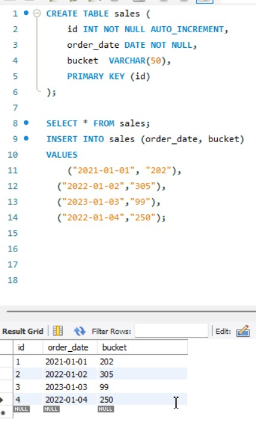
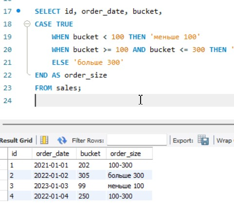
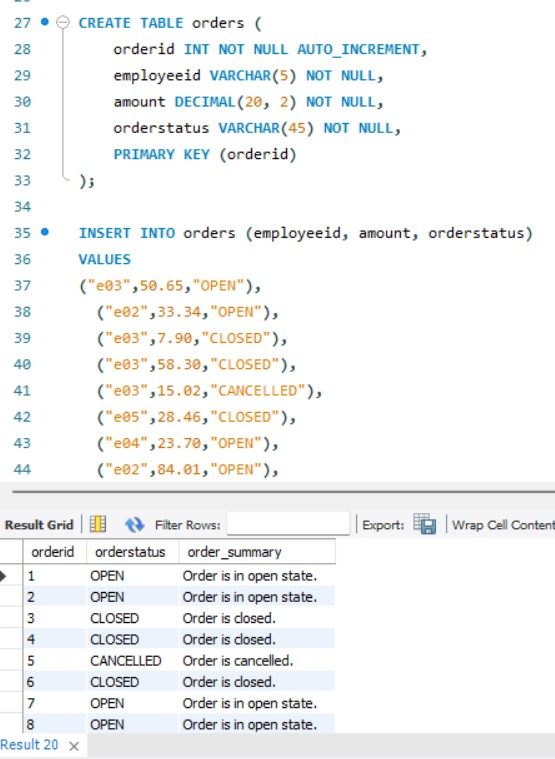
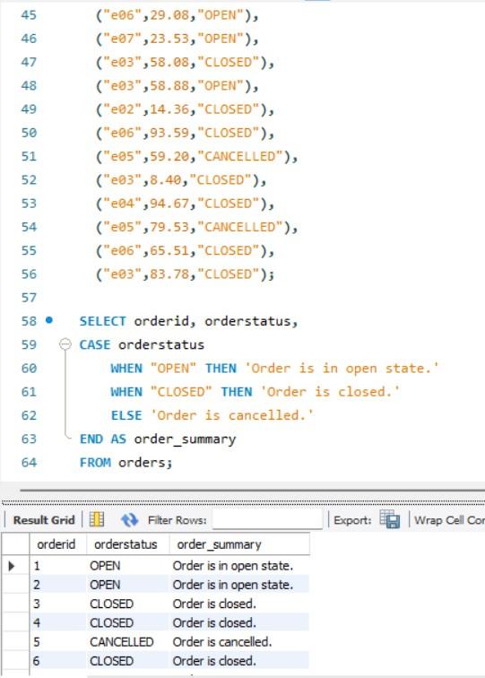

1. Используя операторы языка SQL, создайте табличку “sales”. Заполните ее данными

2.Сгруппируйте значений количества в 3 сегмента — меньше 100, 100-300 и больше 300.

3.Создайте таблицу “orders”, заполните ее значениями. Покажите “полный” статус заказа, используя оператор CASE.

4. Чем NULL отличается от 0?
Null- поле, которые не содержит знечения, то есть "пустое поле", а 0-это цифра и ячейка, 
где стоит 0, будет считаться заполненной, то есть не пустой.